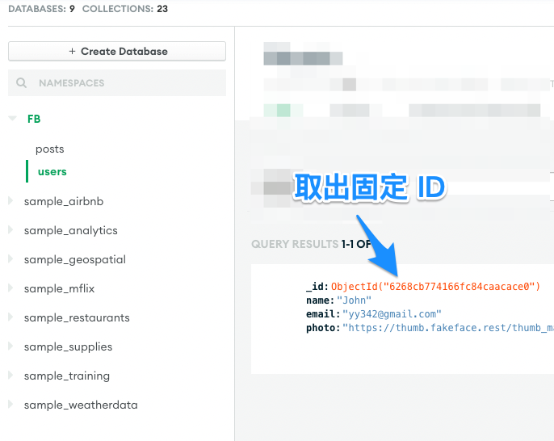

第四週：期中考：打造全端 (Full Stack) 網站架構
===

## 主線任務

期中考 - 前後端分離開發

##　設計稿

- Adobe XD 下載網址 (僅供有參加 Node.js 直播班授權同學)

## 等級表

- LV1：整合 user model，只做後端 API
  
  - 設計[這頁](https://xd.adobe.com/view/c0763dbe-fc15-42e8-be0b-8956ed03e675-9525/screen/5b6bb2a0-f0f3-4b39-841f-8cf3a0ed9707)的 GET API、
  - 設計[這頁](https://xd.adobe.com/view/c0763dbe-fc15-42e8-be0b-8956ed03e675-9525/screen/dfc7891e-63fd-4141-989a-8776ee7ea9f0) POST API
  - 發文人 ID 可先固定

- LV2：前後端都做

  - [3.全體動態牆](https://xd.adobe.com/view/c0763dbe-fc15-42e8-be0b-8956ed03e675-9525/screen/5b6bb2a0-f0f3-4b39-841f-8cf3a0ed9707)，並需設計篩選功能(從新到舊貼文、從舊到最新、關鍵字搜尋)
  - [3-3.全體動態牆-沒有動態](https://xd.adobe.com/view/c0763dbe-fc15-42e8-be0b-8956ed03e675-9525/screen/fb06b070-009d-4ccf-9d60-248b9f51dcd4)
  - [7.張貼動態](https://xd.adobe.com/view/c0763dbe-fc15-42e8-be0b-8956ed03e675-9525/screen/dfc7891e-63fd-4141-989a-8776ee7ea9f0)：上傳圖片按鈕請移除，改用 input.text，直接放圖片網址，可做簡易 client 驗證，是否開頭字串為 https

- LV3：前後端都做 + 試著自己接 imgur API

  - 先上傳成功回傳圖片網址後，再送出貼文

## 繳交內容

1. 您的 Discord 名稱
1. 作業網址：請提供 Github 連結，Github 需附上 POSTMAN Collections Heroku 版本檔案

## 發文人 ID 固定

開發時，直接連雲端資料庫，儲存 user 資料獲得 ID 後，再寫死在前端發 POST API

  